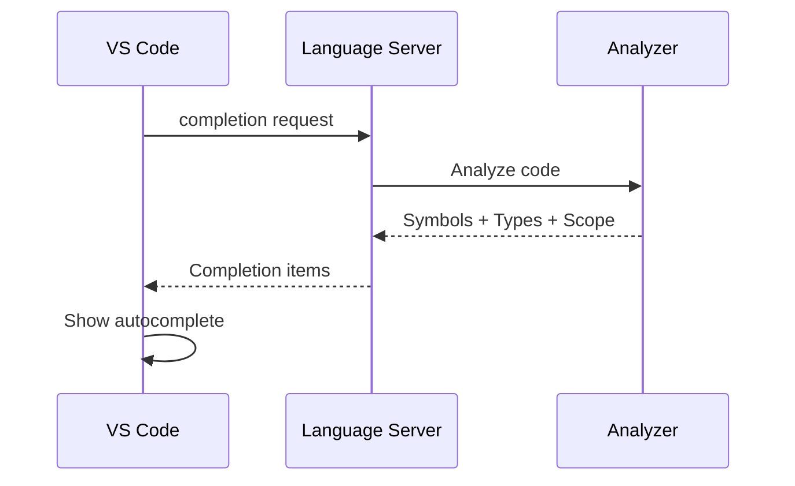
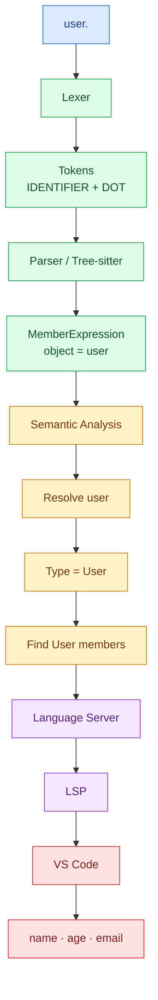
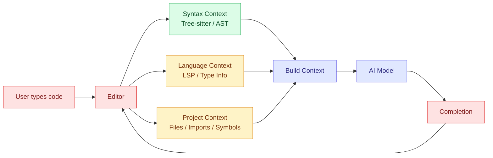

# Compiler & Code Intelligence: Lexer, Parser, AST, Tree-sitter & LSP

## 🧠 Big Picture

```mermaid
flowchart LR
    A[Source Code] --> B[Lexer]
    B --> C[Tokens]
    C --> D[Parser]
    D --> E[AST / Syntax Tree]
    E --> F[Semantic Analysis]
    F --> G[Language Server]
    G --> H[LSP]
    H --> I[VS Code]

    classDef source fill:#dbeafe,stroke:#2563eb,color:#1e3a8a
    classDef syntax fill:#dcfce7,stroke:#16a34a,color:#14532d
    classDef semantic fill:#fef3c7,stroke:#d97706,color:#78350f
    classDef protocol fill:#f3e8ff,stroke:#9333ea,color:#581c87
    classDef editor fill:#fee2e2,stroke:#dc2626,color:#7f1d1d

    class A source
    class B,C,D,E syntax
    class F,G semantic
    class H protocol
    class I editor
```



---

## 1. Lexer

Turns raw characters into **tokens**.

```ts
const user = 26;
```

becomes roughly:

```text
CONST
IDENTIFIER(user)
ASSIGN
NUMBER(26)
SEMICOLON
```

### Remember

> **Lexer = "What are the pieces?"**

### Lexeme vs Token

```text
"user"             → lexeme (actual text)
IDENTIFIER(user)   → token
```

---

## 2. Grammar

Grammar defines **what arrangements are valid**.

Example:

```text
variable_declaration
    → "const" identifier "=" expression
```

Therefore:

```ts
const user = something;
```

✅ Valid structure

```ts
const = user;
```

❌ Invalid structure

### Remember

> **Grammar = rules for arranging tokens.**

---

## 3. Parser

The parser takes tokens and applies the grammar.

```text
Tokens
  ↓
Parser + Grammar
  ↓
Syntax Tree
```

Example:

```ts
const result = 10 + 20;
```

Conceptually:

```text
VariableDeclaration
├── name: result
└── value:
      +
     / \
   10   20
```

### Remember

> **Parser = applies grammar and builds structure.**

---

## 4. AST / Syntax Tree

AST = **Abstract Syntax Tree**

It represents the structure of the program.

```ts
user.name;
```

roughly:

```text
MemberExpression
├── object: user
└── property: name
```

### Remember

> **AST = structured representation of code.**

---

## 5. Tree-sitter

Tree-sitter is an **editor-friendly parsing system**.

```text
Source Code
   +
Language Grammar
   ↓
Tree-sitter
   ↓
Syntax Tree
```

### Why is it useful?

#### Incremental Parsing

If you change:

```ts
age: 26;
```

to:

```ts
age: 27;
```

Tree-sitter can update the affected part of the tree instead of reparsing everything from scratch.

#### Error Recovery

While typing:

```ts
const user =
```

the code is incomplete.

Tree-sitter can still maintain a useful tree:

```text
VariableDeclaration
├── user
├── =
└── ERROR
```

Instead of simply stopping, it tries to preserve as much useful structure as possible.

### Remember

> **Tree-sitter = grammar-driven, incremental, error-tolerant syntax parsing for editors.**

---

## 6. Semantic Analysis

Syntax tells us:

```ts
user.name;
```

is a member-access expression.

Semantic analysis asks:

> **What does `user` actually mean?**

Example:

```ts
const user = getUser();

user.name;
```

It may determine:

```text
getUser()
    ↓
returns User
    ↓
user : User
    ↓
User has:
  name
  age
  email
```

Semantic analysis deals with:

```text
Scope
Symbols
Types
References
Imports
Declarations
```

### Remember

> **Syntax = what the code looks like.**
>
> **Semantics = what the code means.**

---

## 7. Language Server

A language server uses syntax + semantic information to provide:

```text
Autocomplete
Go to Definition
Find References
Hover
Rename
Diagnostics
Code Actions
```

Example:

```ts
user.
```

The language server can determine:

```text
user → User
User → name, age, email
```

and return:

```text
name
age
email
```

---

## 8. LSP

LSP = **Language Server Protocol**

LSP is **not a parser** and **not a type checker**.

It is the communication protocol between the editor and language server.



### Remember

> **LSP = "How does the editor talk to the language server?"**

---

## 9. Autocomplete — Put Everything Together

Consider:

```ts
const user = getUser();

user.
```



---

## 10. Important Distinction

| Concept               | Main Job                        |
| --------------------- | ------------------------------- |
| **Lexer**             | Characters → Tokens             |
| **Grammar**           | Defines valid structure         |
| **Parser**            | Tokens → Structure              |
| **AST**               | Represents structure            |
| **Tree-sitter**       | Fast/incremental syntax parsing |
| **Semantic Analysis** | Understands meaning             |
| **Language Server**   | Provides language features      |
| **LSP**               | Communication protocol          |
| **VS Code**           | Displays the features           |

---

## 11. The Mental Model

Remember these questions:

```text
Lexer
→ "What are these pieces?"

Parser
→ "Are these pieces arranged correctly?"

AST / Tree-sitter
→ "What's the structure?"

Semantic Analysis
→ "What does it mean?"

Language Server
→ "What useful programming information can I provide?"

LSP
→ "How do I send that information to the editor?"

VS Code
→ "How do I show it?"
```

---

## 12. For an AI Code Completion Extension

AI completion can use **both code intelligence and AI**:



Instead of sending the AI blindly:

```text
"Here is the whole file. Complete the code."
```

you can build structured context:

```text
Cursor is inside:
    function fetchUser()

Current scope:
    user: User

Current syntax:
    member access

Nearby code:
    user.

Relevant symbols:
    User.name
    User.email
    User.id
```

This can give the model much more useful context.

---

# ⭐ Final Cheat Sheet

```text
SOURCE
  ↓
LEXER
  → characters → tokens
  ↓
PARSER + GRAMMAR
  → tokens → structure
  ↓
AST / TREE-SITTER
  → editable syntax tree
  ↓
SEMANTIC ANALYSIS
  → scope, types, symbols, references
  ↓
LANGUAGE SERVER
  → completion, hover, definition, diagnostics...
  ↓
LSP
  → communication protocol
  ↓
VS CODE
  → displays the result
```

> **Tree-sitter understands syntax.**
>
> **Semantic analysis understands meaning.**
>
> **Language server provides language features.**
>
> **LSP communicates those features to the editor.**
>
> **Your AI can consume this structured context to generate better completions.**
