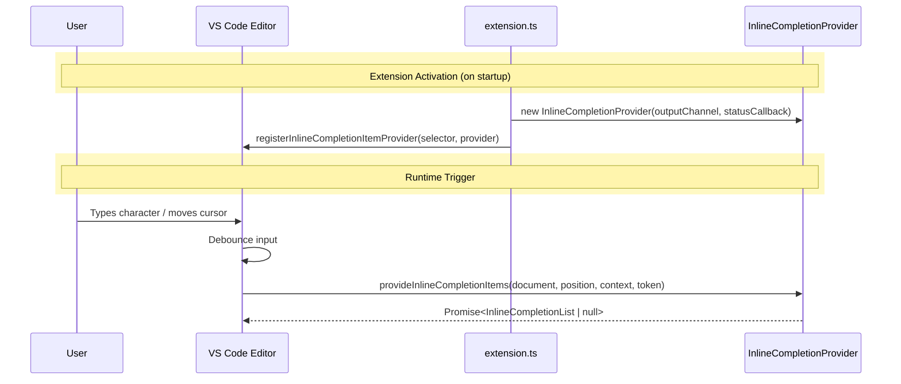
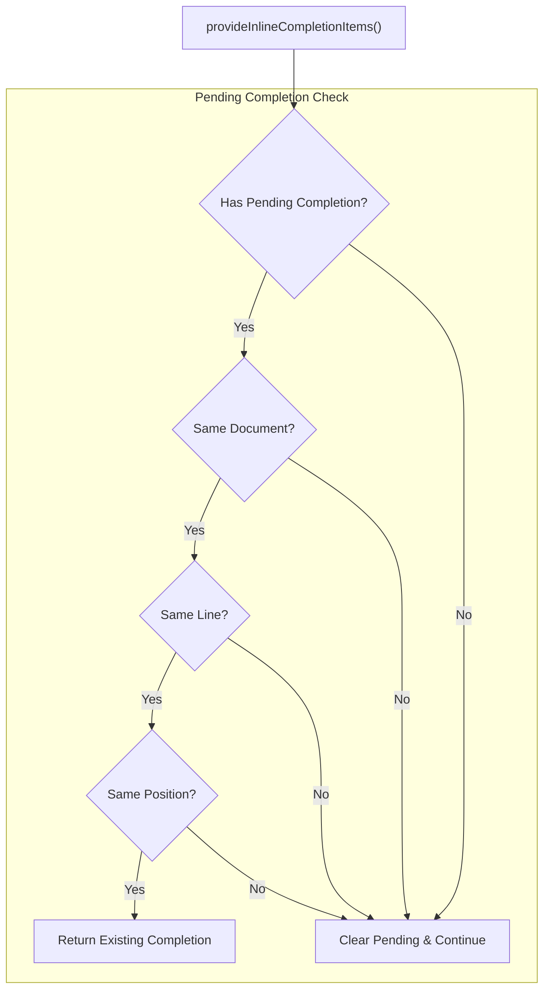
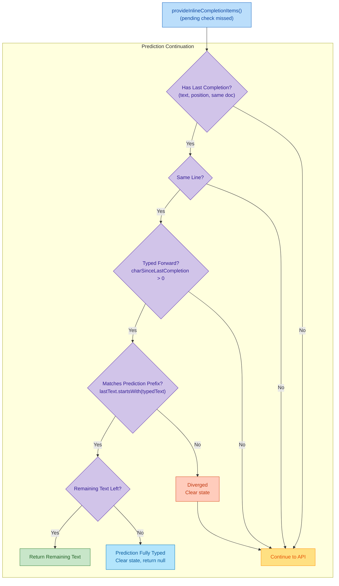
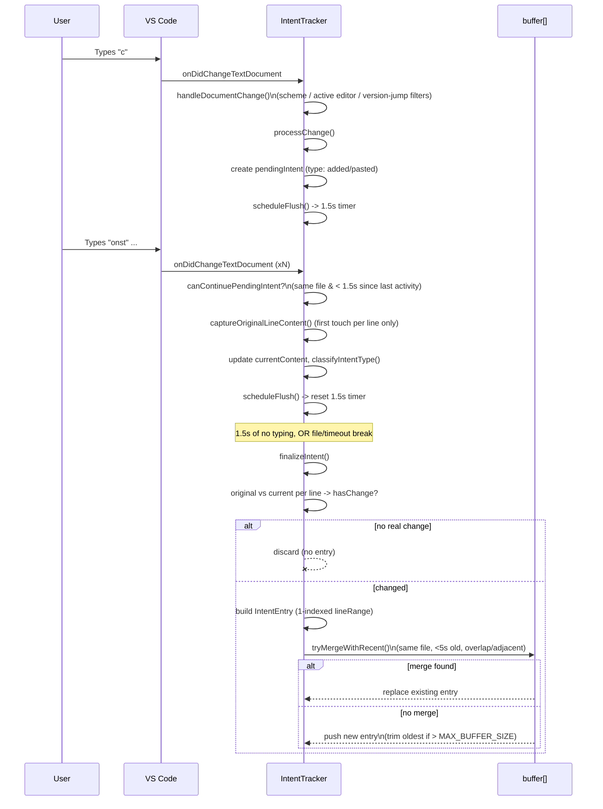
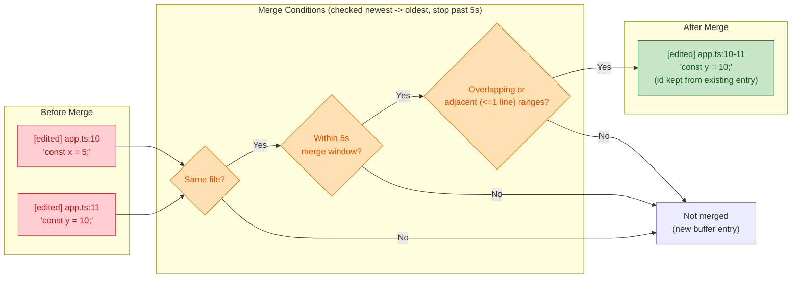
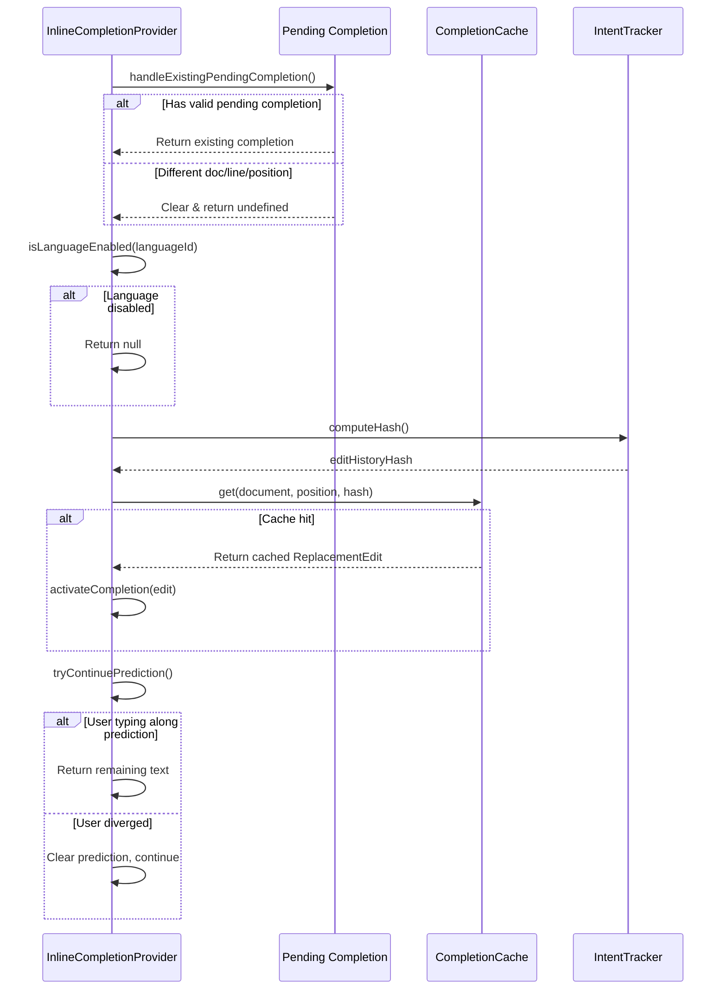
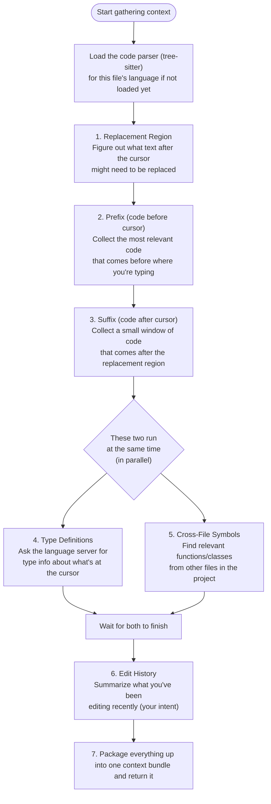
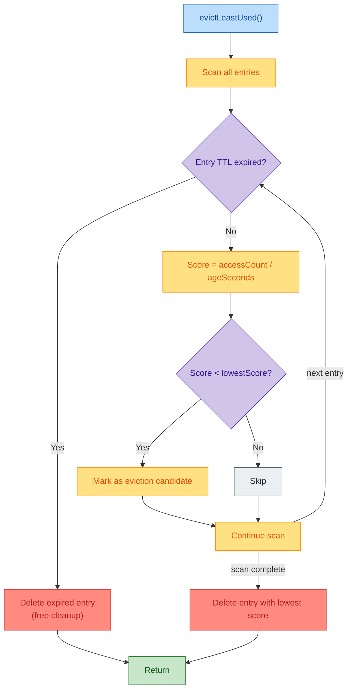
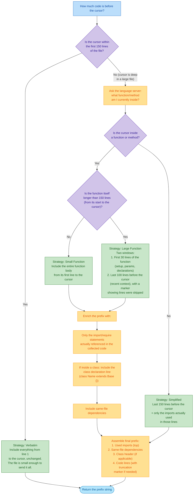

# Activation & Trigger Flow

Two phases, from the sequence diagram.

## Diagram

## Activation (on startup)

`extension.ts` runs on activation and:

1. `new InlineCompletionProvider(outputChannel, statusCallback)` — provider owns the completion logic; `outputChannel` for logging, `statusCallback` to report state back (e.g. status bar).
2. `vscode.languages.registerInlineCompletionItemProvider(selector, provider)` — hands the provider to the editor. `selector` decides which documents/languages it applies to.

After this, `extension.ts` is out of the loop — the editor talks to the provider directly.

so basically, upon startup new `InlineCompletionProvider` is created and registered with the editor. The provider will be used to handle the completion requests from the editor. The provider will be responsible for gathering context, constructing prompts, calling the LLM API, processing the response, and displaying the suggestions in the editor.

## Runtime trigger

1. User types a character or moves the cursor.
2. Editor debounces the input (avoids one request per keystroke).
3. Editor calls `provideInlineCompletionItems(document, position, context, token)`.
4. Provider returns `Promise<InlineCompletionList | null>` — `null` means no suggestion.

`token` is the cancellation token: if the user keeps typing, the editor cancels the in-flight request, so every step after this (cache check, context gathering, LLM call) must bail on cancellation.

Everything in [architecture.md](architecture.md) steps 2–7 happens inside step 3 above.

# Simplified MVP

# Pending Completion Handling

`provideInlineCompletionItems` reuses an in-flight/last suggestion instead of
re-requesting the LLM when the cursor hasn't moved off it.
Handle vscode firing `provideInlineCompletionItems` multiple times in the exact same position. This often happens - focus changes, re-renders, etc. — without the user typing anything. It then returns the same `pendingCompletion` if it hasn't changed.

## Prediction Continuation (`tryContinuePrediction`)

Handles the case where the user typed forward, matching what the ghost text already predicted. It checks if the typed text is a prefix of `lastCompletionText`; if so, it slices off what's left and re-anchors it at the new cursor position with no new LLM call.

## Intent Tracking Flow (`IntentTracker`)

buffers raw text-change events into higher-level `intent` entries for the LLM's edit-history context.
[intent-tracker.ts](../src/services/intent-tracker.ts).
Flow: keystroke → `handleDocumentChange` filters (active file only, skips undo/redo) → `processChange` groups changes into a `pendingIntent` if same file + <1.5s since last edit, else flushes old one and starts new → `classifies` type (added > edited, or pasted if >50 chars) → 1.5s debounce timer → `finalizeIntent` builds an `IntentEntry` and either `merges` it into a recent buffer entry (`tryMergeWithRecent`, if same file + within 5s + line ranges overlap/adjacent) or pushes it to the buffer (capped at 35).

### Merge Logic (`tryMergeWithRecent`)

Note: content is not concatenated on merge — the merged entry takes the
_new_ entry's `content` and `timestamp` outright (`intentEntry.content`,
[intent-tracker.ts:301](../src/services/intent-tracker.ts#L301)), only the
line range is widened to cover both. So `'const y = 10;'` above replaces
`'const x = 5;'` rather than joining it; only `type` is chosen by priority
(`edited` > `pasted` > whatever the new entry was).

### Notes

- **Filtering (`handleDocumentChange`)**: ignores non-file documents, edits outside the active editor, and version jumps > 1 (undo/redo) — an undo/redo drops the in-flight `pendingIntent` instead of aggregating it.
- **One intent = one burst of typing.** `pendingIntent` stays open while edits keep landing in the same file within `INTENT_TIMEOUT` (1.5s, [constants.ts](../src/utils/constants.ts)); a gap, a file switch, or an undo/redo forces `finalizeIntent()` first.
- **`captureOriginalLineContent`** only records a line's _before_ state the first time that line is touched in the current intent — later edits to the same line don't overwrite it, so the diff against `currentContent` reflects the whole burst, not just the last keystroke.
- **`classifyIntentType`**: `pasted` (text > 50 chars in one change, `PASTE_TEXT_LENGTH_LIMIT`) always wins; otherwise `added` if any affected line went from blank to non-blank, else `edited`.
- **`finalizeIntent`** drops the intent entirely if `current.trim() === original.trim()` for every affected line (e.g. type-then-undo-by-hand nets no change).
- **`tryMergeWithRecent`** folds a new entry into a recent one (within `BUFFER_MERGE_TIME_LIMIT`) in the same file if their line ranges overlap or sit within 1 line of each other — keeps the buffer from fragmenting one logical edit into many entries. Note: the constant is named `BUFFER_MERGE_TIME_LIMIT = 50000` with a `//5s` comment in [constants.ts](../src/utils/constants.ts) — the value is actually 5s, the comment is stale.
- **Buffer eviction**: FIFO, oldest entry dropped once `buffer.length > MAX_BUFFER_SIZE` (35).
- **Unfinished**: `handleActiveEditorChange()` and `dispose()` both currently `throw new Error("Method not implemented.")` — switching editors or disposing the extension will throw as-is.

## Full Lifecycle (target architecture)

Sequence across the request's whole lifecycle, including pieces not yet
built: `isLanguageEnabled`, `CompletionCache`/`computeHash`, and
`IntentTracker` don't exist in [inline-completion-provider.ts](../src/providers/inline-completion-provider.ts)
today — this is the target design, not the current implementation.

## Context Gathering (target design)

Same target-design status as the sections above — `LSPService`,
`CrossFileSymbolService`, and `ASTService` don't exist yet in
[inline-completion-provider.ts](../src/providers/inline-completion-provider.ts).
See [architecture.md](architecture.md) step 3 for the prose walkthrough.

## Cache Eviction Strategy (target design — `evictLeastUsed`)

Hybrid LRU + LFU eviction for `CompletionCache` (not yet implemented — same
target-design status as the section above). TTL expiry gives the LRU half
(time-based), `accessCount / ageSeconds` gives the LFU half (frequency-based,
lower score = less useful = eviction candidate). One call evicts at most one
entry: the first expired entry found, or, if none are expired, the lowest-scoring
one across the whole scan.

- **LRU half**: TTL expiry — an entry idle past its time-to-live is deleted
  immediately on sight, no need to compare it against anything else.
- **LFU half**: for non-expired entries, `score = accessCount / ageSeconds`
  approximates "uses per second alive" — the lowest-scoring entry seen during
  the scan is tracked as the eviction candidate and deleted only after the
  full scan confirms no entry was expired.
- Expired-entry cleanup and lowest-score eviction are mutually exclusive per
  call: finding an expired entry short-circuits the scan and returns
  immediately, so the LFU comparison never runs against entries scanned after it.

## Prefix Stage (target design)

How the prefix (code before the cursor) is built for the LLM prompt. Small
files/functions get sent verbatim; large ones get windowed via the language
server, then enriched with only the imports/dependencies actually used.

### Notes

- **150-line threshold** decides between two branches: near-top-of-file
  (verbatim, no LSP call needed) vs. deep-in-file (ask the language server to
  locate the enclosing function, then window around it).
- **Simplified strategy** is the fallback when the cursor isn't inside any
  function (e.g. top-level/module code deep in a large file) — just a sliding
  150-line window plus used imports, no LSP-derived function boundaries.
- **Small vs. Large function** split is also a 150-line threshold, but
  measured from the function's own start to the cursor, not the file's start.
  Large functions lose their middle (only first 30 + last 100 lines survive),
  with a marker noting the gap so the LLM knows lines were skipped.
- **Enrichment is shared** by both the Small Function and Large Function
  branches (imports → class header → same-file deps), but the Simplified and
  Verbatim strategies skip straight to assembly — Simplified already computed
  its own "used imports," and Verbatim needs no enrichment since it's the
  whole file-to-cursor already.
- **Import filtering** is not "all imports" — only ones actually referenced
  in the collected code lines are included, to keep the prefix compact.
