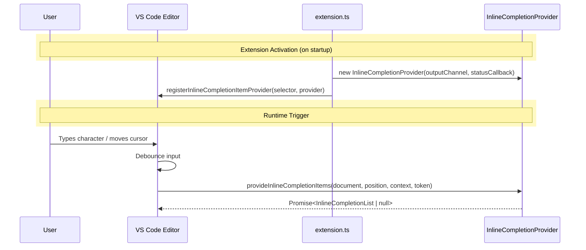

# Activation & Trigger Flow

Two phases, from the sequence diagram.

## Diagram

## Activation (on startup)

`extension.ts` runs on activation and:

1. `new InlineCompletionProvider(outputChannel, statusCallback)` — provider owns the completion logic; `outputChannel` for logging, `statusCallback` to report state back (e.g. status bar).
2. `vscode.languages.registerInlineCompletionItemProvider(selector, provider)` — hands the provider to the editor. `selector` decides which documents/languages it applies to.

After this, `extension.ts` is out of the loop — the editor talks to the provider directly.

so basically, upon startup new `InlineCompletionProvider` is created and registered with the editor. The provider will be used to handle the completion requests from the editor. The provider will be responsible for gathering context, constructing prompts, calling the LLM API, processing the response, and displaying the suggestions in the editor.

## Runtime trigger

1. User types a character or moves the cursor.
2. Editor debounces the input (avoids one request per keystroke).
3. Editor calls `provideInlineCompletionItems(document, position, context, token)`.
4. Provider returns `Promise<InlineCompletionList | null>` — `null` means no suggestion.

`token` is the cancellation token: if the user keeps typing, the editor cancels the in-flight request, so every step after this (cache check, context gathering, LLM call) must bail on cancellation.

Everything in [architecture.md](architecture.md) steps 2–7 happens inside step 3 above.

# Simplified MVP

Text before cursor -> LLM -> Ghost Suggestion
